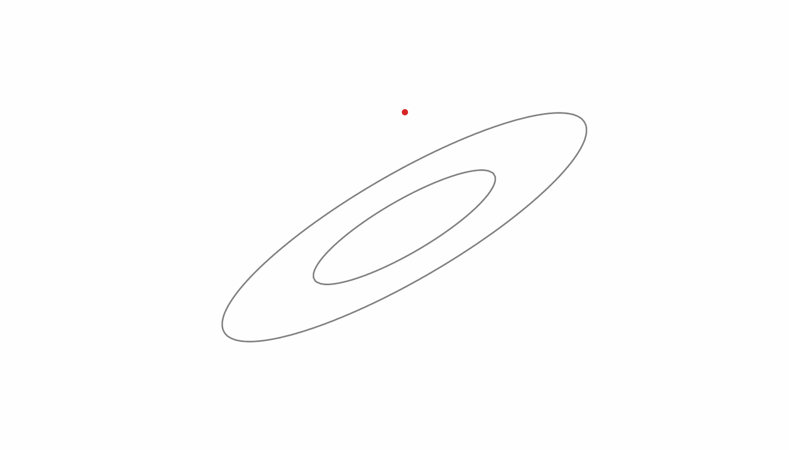

# Bayesian Statistical Methods and Data Analysis

## About this course

The course was taught in June 2023 at ETH Zurich. The covered material is listed in the [syllabus](syllabus.md). It ranges from an introduction to probability theory up to Hamiltonian Monte Carlo and simulation-based inference. Since the course aims to focus mostly on showing how to use statistical tools, the various topics are introduced only relatively briefly. There are many great books and courses on this topic, which go into more detail and which I encourage you to look at before the lectures. The resources listed here all are available online, either directly or through the ETH library. For example:

- Practical Statistics for Astronomers, Wall, 2012 [ETH library](https://eth.swisscovery.slsp.ch/permalink/41SLSP_ETH/lshl64/alma99117170816205503). Short, with a focus on practical applications. Many of the examples and exercises are from astrophysics but are generally applicable, especially for the physical sciences, which often come a bit short in general statistics textbooks. Solutions and data sets are [available online](https://www.astro.ubc.ca/people/jvw/ASTROSTATS/pracstats_web_ed2.html).
- Bayesian Data Analysis, Gelman, 2013 [ETH library](https://eth.swisscovery.slsp.ch/permalink/41SLSP_ETH/lshl64/alma99117222397805503). The title says it all.
- Information Theory, Inference, and Learning Algorithms, MacKay, 2003 [Link](http://www.inference.org.uk/itprnn/book.pdf). Heavy on the information theory but also covers inference methods nicely. The exercises come with solutions.
- Weighing the odds, a course in probability and statistics, Williams, 2001 [ETH library](https://eth.swisscovery.slsp.ch/permalink/41SLSP_ETH/lshl64/alma99117170967205503). A good introduction to probability theory and statistics with a high level of mathematical rigour.

## This repository

- `lectures`: The lecture notebooks, which are used to create the slides and pdfs.
- `slides`: Slides for the lectures.
- `pdf`: PDF versions of the lecture notebooks.
- `exercise_solutions`: Solutions to selected exercises.
- `course_tools`: Tools for creating this course, such as a script to generate the slides from the notebooks and a python package with helper functions.
- `syllabus.md`: Reasonably complete lists of what was covered in the lectures.

## Acknowledgements

This course was inspired by Jasper Wall's astrostatistics course at UBC, as well as lectures by Adam Amara and talks by François Lanusse. 
